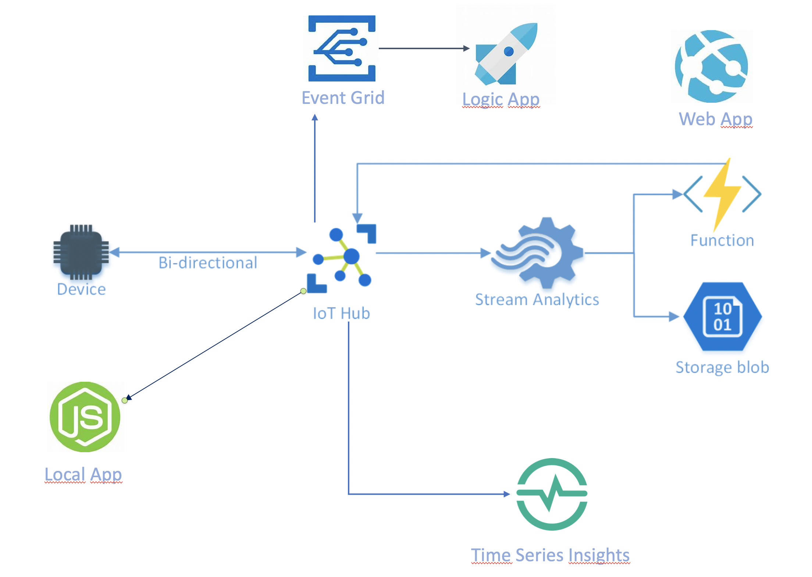
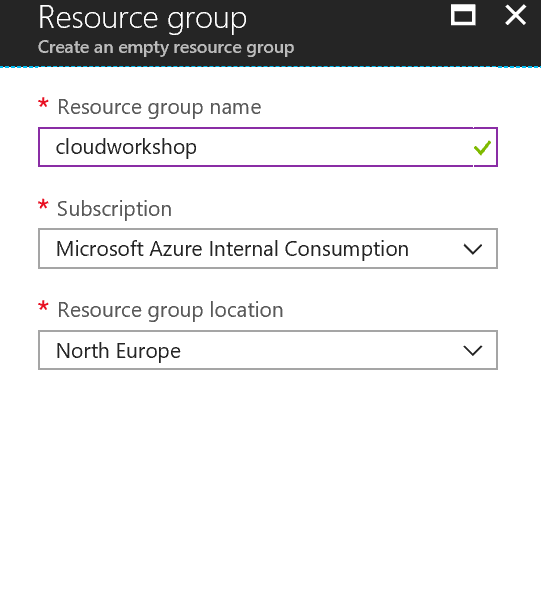
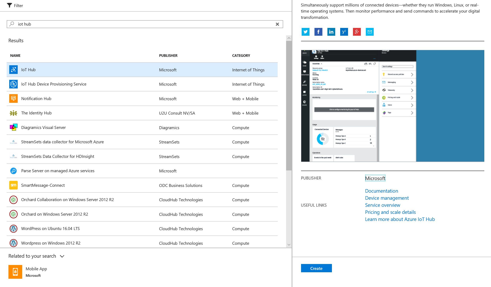
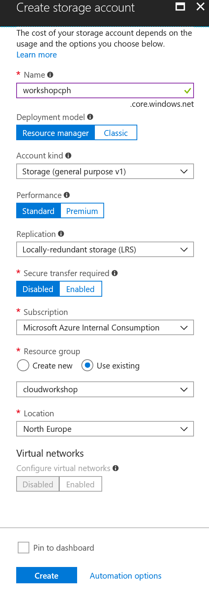
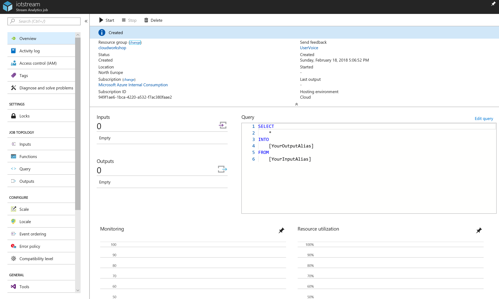
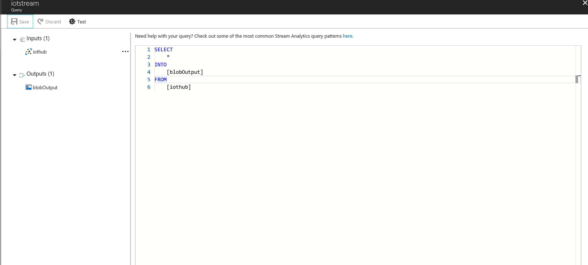
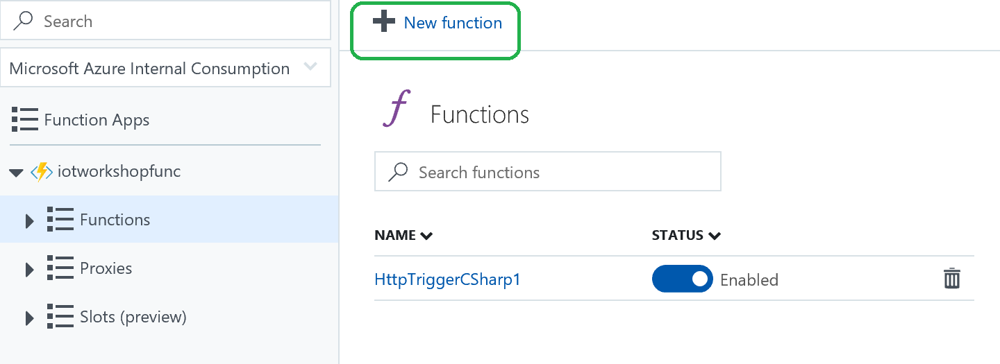


# Lab A1
For this lab we will:
* use a raspberry pi to send measurements to an IoT Hub, 
* visualize the event flow on the iot device explorer, 
* save the messages to blob storage 
* visualize the time series event 
* create actions.
* create a custom dashboard

BY FOLLOWING A STEP BY STEP GUIDE

Pre-requisites:
* You need to have an azure subscription that allows you to create resources
* A raspberry pi with a temperature and humidity sensor connected
* The [device explorer](https://github.com/Azure/azure-iot-sdk-csharp/tree/master/tools/DeviceExplorer) installed on your windows laptop or [azure cli](https://marketplace.visualstudio.com/items?itemName=vsciot-vscode.azure-iot-toolkit) with the iot hub extension] or [visual code(https://docs.microsoft.com/en-us/azure/iot-hub/iot-hub-device-management-iot-toolkit) with azure iot hub extension]


You will create resources that will implement a standard reference archutecture as:


## Step-by-step guide

### On azure Portal

Sign in to <http://portal.azure.com>

### Create Resource group
On the left pane choose Resource Groups
Click the "+ Add" button to create a new Resource group
Give the Resource group a name and choose North Europe as region



### Create IoT Hub
You might need to the refresh icon in Azure to see your new Resource group
Select your new Resource group and then click the "+ Add" button to add an IoT hub
Search for IoT Hub and then click “Create”



IoT Hub setting
Give the IoT Hub a name 
Select the F1 pricing tier
Use the Resource group you just created
Location North Europe


 
Go back to your Resource group and verify that the IoT Hub there
Create three consumer groups for the default route, one for device explorer, one for time series insights and one for seam analytics
  

Create a device, copy the connection string


### On Raspberry Pi
1. SSH into the Device
2. cd /iot
3. ./iot "<CONNECTION STRING>
   

### On yiur laptop 
Verify message flow on Device explorer or CLI or Visual Code


### Create Time Serie Insights environment and associate with your IoT Hub
* Search for Time Series Insights and then click “Create” with defaults
* Associate the IoT Hub created on the step above to the environment

* Go to your environment
* Add the measurements to your current view  

* Zoom in and out, explore the time series

### Create Blob storage
Add a Storage account to your Resource group
 
Storage account settings 
* Give the Storage account a name
* Select your Resource group
* Location North Europe
* Leave everything else with default settings



### Create Stream Analytics Job

Add a Stream Analytics job to your Resource group
Stream Analytics Job setting
* Give the Stream Analytics job a name
* Use your Resource group
* Location North Europe
* Hosting environment (Cloud)
 
Go back to your Resource group and select the Stream Analytics job
Click Input to create a new input for the Stream Analytics job
 
Click the “Add Stream Input” button, select IoT Hub and setup it up to receive messages from your IoT Hub



Give the Stream Analytics job an output and select Blob storage as the output type


 
Edit the Stream Analytics Query by change the input to your IoT Hub name and the output to your Blob Storage name


 
1. Start the Stream Analytics job from the Stream Analytics Overview page
2. Verify that the telemetry is being stored in the blob container

**BONUS TASK**
Modify your query so you will store only humidity above 60 in a container called high humidity (hint: you can breathe out on the sensor to increase the humidity)  

## ACTIONS

### Create an Azure Function App (requires programming skills)
Go back to your Resource group and add an Azure Function App.
 
1. In the settings for the Function App select North Europe as location, choose your favorite stack
2. Create a new function (select HTTP trigger)



1. Use the default code
2. Update your Stream Analytics query so it is like below (define inputs and outputs with aliases you provided)

```sql
SELECT
*
INTO
    [outputblob]
FROM
    [iothubinput]

    SELECT 
    humidity
    INTO
    [functionOutput]
    FROM 
    [iothubinput]

```


Start the Stream Analytics job (wait with next step until it is started)
Verify that the Function triggers.

Modify the query so only humidity over a threshold value will generate a trigger.

**Bonus Task** Modify the Function App so it does something useful (requires programming skills)

## ITTT
In this step we wiill send an email to an administrator when a device is created without using any code!

* Create an association between IoT Hub events and Event Grid. Select Events from the IoT Hub Menu 
  
  Select LOGIC APP
Modify the event hook as shown below, then press nest step
  
  Choose Outlook or Gmail as your Connector, then send mail as action, edit the details of your message
  

Go back to the portal (or device explorer) and create a new device. Check that an email is received by the recipient you selected 


### Create a Power BI dashboard (requires Power BI account)

Modify your stream analytics job to output to Power BI
Authorize Stream Analytics to ouput to Power BI, choose a dataset and a table name
Start the job

Login to [power bi](http://powerbi.com).
Create a report and a dashboard of your liking.
