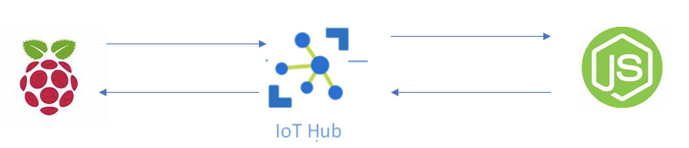

## Azure IoT Cloud Workshops# Lab A1
For this lab we will:
* use a raspberry pi to send measurements to an IoT Hub, 
* visualize the event flow on the iot device explorer, 
* save the messages to blob storage 
* visualize the time series event 
* create actions.
* create a custom dashboard

BY USING THE AZURE SDKs AND SAMPLES FOUND [HERE](https://github.com/Azure/azure-iot-sdks)

## EXTRA HARD !

